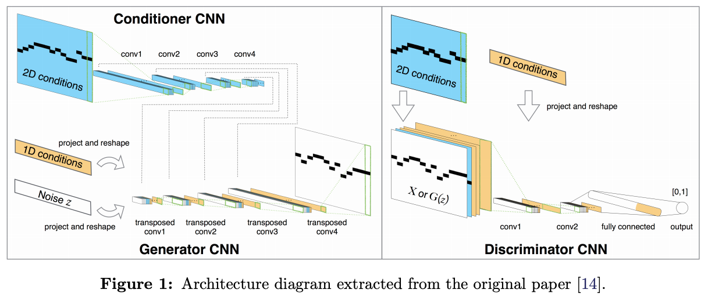

## Generating Music with Deep Learning

This repository contains all the scripts used in the project *Generating Music with Deep Learning*. It is divided into two folders:

- `midinet`. It covers the second part of the project.
- `preliminary_work`. It includes the preprocessing steps for MAESTRO dataset, as well as the codes for training the LSTM, GAN and VAE models.

In every folder you will find additional information.

------

*Spoken and Written Language Processing*, GCiED

Alex Carrillo, Pau Magariño, Guillermo Mora and Robert Tura

-June 19, 2020, *Universitat Politècnica de Catalunya*

> *Abstract*. This paper presents various approaches of music generation based on deep learning techniques. First, after a short introduction to the topic, the article analyses three early proposals: a LSTM, a Variational Autoencoder and a GAN, for symbolic music generation on MIDI, and we gently illustrate the variety of concerns they entail. Second, we leverage the power of a novel architecture called MidiNet by conducting our own refinements, and give examples of how this model, equipped with such a conditional mechanism on melody, can achieve very promising results on music generation.

### Contents

1. **Aim and motivation**
2. **Introduction**
   1. MIDI
   2. Piano roll
   3. Dataset and Preprocessing
3. **First approach**
   1. First models
      1. *LSTM*
      2. *Variational Autoencoder*
      3. *GAN*
   2. Main findings
4. **MidiNet**
   1. Overview
   2. Dataset and Preprocessing
   3. Architecture details
   4. Errors corrected
5. **Proposed models**
   1. MidiNet Baseline
   2. Embeddings
   3. Spectral normalization
   4. Previous data to the discriminator
   5. MLP discriminator
   6. Embeddings with previous data plus spectral normalization
6. **Results comparison**
   1. Baseline
   2. Embedding
   3. Spectral Normalization
   4. Previous data to the discriminator
   5. MLP discriminator
   6. Embeddings with previous data plus spectral normalization
7. **Conclusions**
8. **Further work**
9. **References**